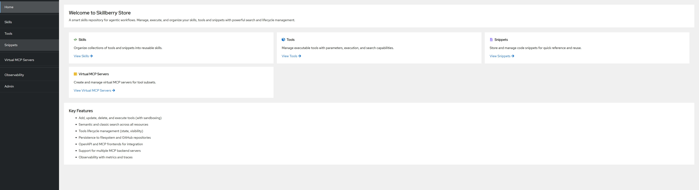

# Skillberry-store service (a.k.a., SBS)

This service implements a smart skills repository for agentic workflows. Manage, execute, and organize your skills, tools and snippets with powerful search and lifecycle management.



## Features ✨

- **Manage tools for agentic workloads**: Add (Persist), Remove, Update, and Delete tools.
- **Tools Execution**: Invoke tools (with parameters) using Docker (sand-boxing).
- **Tools Search and list**: Shortlist tools using semantic and classic search.
- **Tools Life Cycle Management**: Provides tools life cycle management (state, visibility, etc.).
- **Tools Persistence**: Support persistence of tools into filesystem, GitHub repos etc.
- **Observability**: Provide metrics and traces for operational and behavioural analysis of tools usage.
- **OpenAPI frontend**: FastAPI endpoint to interact and manage tools (using tools-manifest artifacts)
- **MCP frontend**: Expose virtual [MCP](https://github.com/modelcontextprotocol)  servers for any subset of the tools or all of them.
- **Support Multiple MCP backends**: Consume and route additional tools from multiple backend MCP servers.
- **Agentic Framework Integration**: Connect to different agentic frameworks via the MCP frontend.
- **MCP control API**: Exposes an MCP server API for each of the available REST operations ( e.g., add tools, semantic search etc.)


## Quickstart 🚀

### Run the Service with Docker or Podman 🐳


```bash
make docker_run
```

> Note: use `make help` for a complete list of options

You can control where SBS stores its data by setting `SBS_BASE_DIR` (defaults to the system temp directory).

### Interacting with the UI 👨‍💻

The Skillberry Store now includes a modern web UI that starts automatically with the backend:

- **Web UI**: [http://localhost:8002](http://localhost:8002) - Modern React-based interface
- **API Documentation**: [http://localhost:8000/docs](http://localhost:8000/docs) - OpenAPI/Swagger interface

The Web UI provides:
- Visual management of Tools, Skills, Snippets, and VMCP Servers
- Search and filtering capabilities
- Tool execution with parameter input
- Code viewing and editing
- Real-time updates

To disable the UI and run only the backend:
```bash
ENABLE_UI=false make run
```

### Using the skillberry SDK 🔌

For more detailed information and programmatic usage, refer to the [Skillberry SDK](https://github.ibm.com/skillberry/skillberry-store-sdk).

## Prerequisites 🛠️

- Docker or Podman is installed on your machine.

The default is `docker`. If you want to use `podman`, include this line
```
docker alias=`podman`
```
into one (or more) of the following configuration files, depending on which shell(s) you are using
- `~/.zshrc`
- `~/.bashrc`
- `~/.bash_profile`
- `~/.profile`

Additional requisites for local deployment:
- Your user has Docker permissions (i.e., is a member of the `docker` group).
- The Docker logging driver is set to either `json-file` or `journald`.

> Check the logging driver with the following command:
> ```bash
> docker info --format '{{.LoggingDriver}}'
> ```
> If the response is not `json-file` or `journald`, configure your Docker logging as documented [here](https://docs.docker.com/engine/logging/configure/#configure-the-default-logging-driver).

## Running with podman on MacOS ⚒️

- Alias `docker` to `podman`, as explained in [Prerequisites](#prerequisites-️)
- Create and start a Podman machine:
```bash
podman machine init --now --cpus=4 --memory=4096 -v /tmp:/tmp podman-machine-default
```   
if you already have a default Podman machine with this name, then you need to first
```bash
podman machine stop
podman machine rm podman-machine-default
```
Then rerun Podman machine initialization and 
```bash
make docker_run
```


## Design Requirements

See [DESIGN_REQUIREMENTS.md](DESIGN_REQUIREMENTS.md)

## Local installation 📦

We support Linux, macOS, and Windows.

```bash
git clone git@github.ibm.com:skillberry/skillberry-store.git
cd skillberry-store
```

On Linux, macOS, or WSL:
```bash
make install_requirements
```

On Windows (no WSL needed):
```cmd
pip install -e .
```

## Start the Service locally (alternative to docker) 🚀

On Linux, macOS, or WSL:
```bash
make run
```

On Windows:
```cmd
sbs-srv
```

*Notes:*

  * By default, SBS runs on host `0.0.0.0` and port `8000` publishing its metrics on port `8090`. To change, set the environment variables SBS_PORT/SBS_HOST/PROMETHEUS_METRICS_PORT
  * To disable observability all together, set environment variable `OBSERVABILITY` with `False`
  * The Web UI starts automatically on port `3000`. To disable it, set `ENABLE_UI=false`
  * On first run, the UI will automatically install its dependencies (requires Node.js 18+)

## Web UI Features 🎨

The Skillberry Store includes a modern React-based web interface with:

- **Tools Management**: Create, view, execute, and delete tools with file upload support
- **Skills Management**: Organize tools and snippets into reusable skills
- **Snippets Management**: Store and manage code snippets with syntax highlighting
- **VMCP Servers**: Create and manage virtual MCP servers for tool subsets
- **Search & Filter**: Semantic search across all resources
- **Real-time Updates**: Automatic refresh of data using TanStack Query
- **Responsive Design**: Built with PatternFly (IBM's design system)

### UI Technology Stack

- React 18 + TypeScript
- Vite (fast development server)
- PatternFly (IBM design system)
- TanStack Query (data fetching)
- React Router (navigation)

### UI Development

To work on the UI separately:

```bash
cd src/skillberry_store/ui
npm install
npm run dev
```

The UI source code is located in `src/skillberry_store/ui/` and includes:
- `src/pages/` - Page components for each section
- `src/components/` - Reusable UI components
- `src/services/` - API client layer
- `src/types/` - TypeScript type definitions

## Loading example tools into the Service 📂

- Set the home directory and the EXAMPLESPATH for skillberry-store environment variables 🌐

```bash
export SBS_HOME=$(pwd)
export EXAMPLESPATH=$SBS_HOME/src/skillberry_store/contrib/examples
```

- Load example tools:

```bash
make ARGS="genai/transformations/client-win-functions.py GetYear GetQuarter GetCurrencySymbol ParseDealSize" load_tools
```

- Alternatively load the example tools using json schema: 

```bash
make ARGS="ClientWinMVP/json ClientWinMVP/functions/transformations.py GetYear GetQuarter GetCurrency GetDealAmount identity" load_tools_json
```


## Engage with the Service via OpenAPI 📜

Open a browser against `http://127.0.0.1:8000/docs` .

## Engage with the Service through a Python Client 🐍

The service can be consumed via skillberry store service sdk. Refer to [skillberry-store-sdk](https://github.ibm.com/skillberry/skillberry-store-sdk) for installation and usage.

## Engage with the Service via MCP 📜

Each control API function is available as an MCP tool to be used by agentic AI workflows.  
To access use an MCP client against `http://127.0.0.1:8000/control_sse` .  

## Run SBS in MCP Server Mode 🖥️

To run SBS in MCP server mode, allowing it to connect to any agent framework that supports MCP, set the MCP_MODE variable:

```bash
MCP_MODE=True make run
```

### Examples of using SBS with Agentic Frameworks 🤖

Follow the steps outlined in [Run SBS with Agent Frameworks](src/skillberry_store/contrib/examples/agent_framework/agent_framework.md).
> Note: the example makes use of SBS in MCP mode

### Support Multiple MCP Backends

Follow the steps outlined in [Connecting MCP as a backend](src/skillberry_store/contrib/mcp/README.md).

## Run SBS with GitHub backend

Follow the steps outlined in [Github backend](docs/github_using_hooks.md).


## Monitoring the Service 📈

### To start a local Prometheus server execute:
```bash
echo -e "global:\n  scrape_interval: 5s\nscrape_configs:\n  - job_name: \"skillberry-store\"\n    static_configs:\n      - targets: [\"localhost:8090\"]\n    metric_relabel_configs:\n      - source_labels: [__name__]\n        regex: '.*_created'\n        action: drop" > /tmp/prometheus.yml
docker run --rm --name prometheus --network="host" -p 9090:9090 -v /tmp/prometheus.yml:/etc/prometheus/prometheus.yml prom/prometheus --config.file=/etc/prometheus/prometheus.yml
```

Metrics are available in Prometheus at http://localhost:9090.
> Note: Application metrics are prefixed with `SBS_`.

### To start a local Jaeger server execute:
```bash
docker run --rm --name jaeger --network="host" -p 4317:4317 -p 16686:16686 jaegertracing/all-in-one:latest
```

Traces are available in Jaeger at http://localhost:16686.


## 📚 Additional documentation can be found at [docs](docs).

* Customizing configurations details can be found [here](docs/config-env-vars.md)
* Guthub support details can be found [here](docs/github_using_hooks.md)
* Registry details can be found [here](docs/container-reigistry.md)