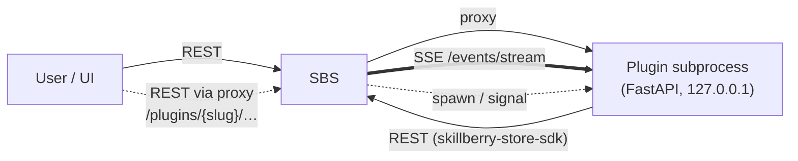
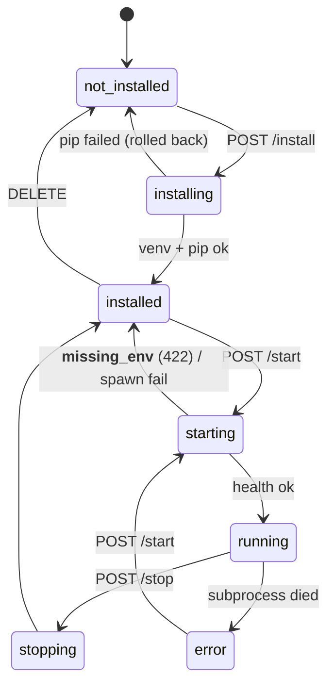
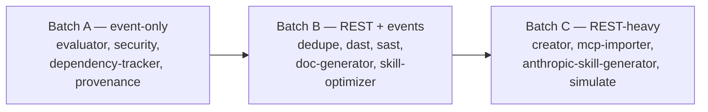

# Plugin Process Migration Plan (Objective 2 only)

Focused implementation plan to move plugin execution from **in-process (thread) hosting** to **out-of-process (subprocess) hosting**, while keeping the plugin sources in their current location under [plugins/](../plugins/).

Analysis, decisions, risks, and target architecture are covered in [plugin-separation-plan.md](plugin-separation-plan.md) — this document only lists the execution stages, gates, and commits.

---

## Scope

**In scope**

- New `skillberry-plugin-sdk` package (co-located under [plugins/](../plugins/) — no separate repo).
- SSE event hub in SBS at `/events/stream`.
- HTTP reverse-proxy in SBS for `/plugins/{slug}/{path:path}` to the plugin subprocess.
- `PluginManager` that installs, starts, stops, restarts, and uninstalls plugins as subprocesses.
- **Full plugin lifecycle API** (`install`, `start`, `stop`, `restart`, `uninstall`) plus a **plugins state file** at the repo root that is authoritative across restarts.
- SBS starts with **zero plugins installed**; the plugin catalog is discovered from the `plugins/` folder on demand.
- **Strict env validation** — starting a plugin whose required env vars are missing fails with a structured error.
- Port all 13 plugin packages to the new SDK; delete the in-process code path.
- Full UI overhaul of the Plugins page: cards/list toggle, text search, install dialog, lifecycle buttons.

**Out of scope (deferred to the umbrella plan)**

- Splitting into a `skillberry-store-plugins` repo (objective 1).
- Multi-developer staged rollout / deprecation windows / cross-team compatibility shims.

---

## Plugin structure (confirmation of the model)

Each plugin process is:

1. **A FastAPI server** hosting `/lifecycle/*` (health, info, ready, shutdown) plus its own optional `/api/*` routes. SBS reaches it *only* through the reverse proxy at `/plugins/{slug}/…`. The plugin binds `127.0.0.1:<port>` — never public.
2. **A client of SBS** — it uses the extended `skillberry-store-sdk` (HTTP + SSE) to read/write content and to subscribe to content events. It never imports anything from `skillberry_store.*`.



---

## Lifecycle model

**Ground rules**

- SBS starts with **no plugins installed** by default. There is no "install everything the venv has" auto-discovery — the state file is authoritative.
- A **plugin state file** at the repo root ([plugins.state.json](../plugins.state.json)) records every installed plugin: `{slug, installed_at, autostart, env_overrides, last_state}`. Missing / empty file ⇒ zero plugins.
- On SBS boot: for each entry in the file with `autostart: true`, the manager installs (if the venv is gone) and starts it. Failures do not block SBS startup — they set the entry's `last_state = "error"` with an error detail.
- The env variable `SKILLBERRY_PLUGIN_STATE_FILE` overrides the file path. Setting it to `""` (or `/dev/null`) tells SBS to boot empty and never persist — this is the mode used by tests.

**API (all under `/plugins/…` on SBS, additive to today's routes)**

| Method | Path | Effect | Failure modes surfaced to caller |
|---|---|---|---|
| `GET` | `/plugins/available` | Enumerate slugs under [plugins/](../plugins/) that are installable (have a `manifest.yaml`) | — |
| `GET` | `/plugins/` | List **installed** plugins with `state` and `missing_env` | — |
| `POST` | `/plugins/{slug}/install?autostart=true` (body: optional `env_overrides`) | Create per-plugin venv, `pip install -e plugins/<slug>`, record in state file, and if `autostart` → start | `409` already installed; `422` bad manifest; `500` pip failure with stderr excerpt |
| `POST` | `/plugins/{slug}/start` | Spawn subprocess; validate env from manifest before spawn; probe `/lifecycle/health` | **`422` `missing_env: [names]`** (the primary failure mode from change #1); `409` already running; `500` health-probe timeout |
| `POST` | `/plugins/{slug}/stop` | Send `POST /lifecycle/shutdown`, then SIGTERM, then SIGKILL after 5 s | `409` not running |
| `POST` | `/plugins/{slug}/restart` | Sequential stop + start; same failure semantics as start | inherits start's failure modes |
| `DELETE` | `/plugins/{slug}` | Stop if running, remove venv, remove state entry | `409` not installed |

**Env validation contract**

Every plugin's `manifest.yaml` declares `required_env`. On any `start` (including autostart at boot and restart), the manager:

1. Merges process env + state-file `env_overrides` for that slug.
2. Checks every `required_env[*].required == true` name exists.
3. If any are missing, **the manager raises before spawning**. The install/start/restart API returns `HTTP 422` with body `{"error":"missing_env","missing":["LLM_PROVIDER"],"manifest_required_env":[…]}`. The subprocess is never started, and `last_state` becomes `error` with `missing_env` in the detail.



---

## Working conventions

- **Single-branch, single-developer.** All work lands on `main`; no PRs.
- **Every stage ends with a commit** (`plugin-proc: stage N — <headline>`, Co-Authored-By per repo convention).
- **Every stage has a green-gate.** Before commit: `pytest` (root + plugin packages) passes; if the stage touches the UI, `npm test` passes; if a plugin was ported, its integration test passes.
- **No feature flag per plugin.** The state file is the only source of truth. `SKILLBERRY_PLUGIN_STATE_FILE=""` is the only knob (used by tests).
- **Blast-radius rule.** No stage removes the in-process code path until all plugins are ported and green (Stage 7).

```
Stage           1  2  3  4  5  6  7  8
SDK             ▣  ▣  ▣  ▣  ▣  ▣  ▣  ▣
SSE             ▢  ▣  ▣  ▣  ▣  ▣  ▣  ▣
Proxy           ▢  ▣  ▣  ▣  ▣  ▣  ▣  ▣
Mgr+lifecycle   ▢  ▢  ▣  ▣  ▣  ▣  ▣  ▣
State file      ▢  ▢  ▣  ▣  ▣  ▣  ▣  ▣
Canary port     ▢  ▢  ▢  ▣  ▣  ▣  ▣  ▣
Fleet port      ▢  ▢  ▢  ▢  ▣  ▣  ▣  ▣
Old code rm     ▢  ▢  ▢  ▢  ▢  ▢  ▣  ▣
UI overhaul     ▢  ▢  ▢  ▢  ▢  ▢  ▢  ▣
```

---

## Stage 1 — Plugin SDK package

Bootstrap the `skillberry-plugin-sdk` package. Purely additive; SBS is untouched.

**Deliverables**

- `plugins/skillberry-plugin-sdk/pyproject.toml`
- `plugins/skillberry-plugin-sdk/src/skillberry_plugin_sdk/`
  - `lifecycle.py` — `PluginLifecycleBase` (FastAPI app + `/lifecycle/health|info|ready|shutdown`).
  - `manifest.py` — `PluginManifest` pydantic model and `manifest.yaml` loader. Declares `required_env` with `{name, description, required, default}`.
  - `events.py` — `EventsClient` SSE subscriber (uses `httpx-sse`, auto-reconnect + `Last-Event-ID`).
  - `store.py` — thin wrapper around `skillberry_store_sdk.ApiClient` reading `SKILLBERRY_STORE_URL` / `SKILLBERRY_STORE_TOKEN`.
  - `runner.py` — `run(PluginClass)`:
    - Reads `SKILLBERRY_STORE_URL`, `SKILLBERRY_STORE_TOKEN`, `SKILLBERRY_EVENTS_URL`, `SKILLBERRY_PLUGIN_PORT`.
    - **Belt-and-braces** re-validates `required_env` from the manifest and exits with a non-zero code + JSON-line stderr `{"error":"missing_env","missing":[…]}` if anything's missing — the manager's pre-spawn check is the primary gate; this catches drift.
    - Binds `127.0.0.1:$SKILLBERRY_PLUGIN_PORT` and launches uvicorn.
  - `decorators.py` — `@on_event("content.skill.added")`.
  - `testing.py` — pytest helpers (used by plugin tests; see Stage 5).
- Unit tests under `plugins/skillberry-plugin-sdk/tests/`.

**Gate**

```
pytest plugins/skillberry-plugin-sdk/tests -q
```

**Commit** — `plugin-proc: stage 1 — introduce skillberry-plugin-sdk`

---

## Stage 2 — SSE event hub + HTTP proxy scaffolding in SBS

Add the transport primitives. Plugins still run in-process; both new endpoints exist but the proxy registry is empty.

**Deliverables**

- `src/skillberry_store/plugins/sse_hub.py` — in-memory pub/sub with per-subscriber queue, topic filter, monotonic event id, N=1000 ring buffer, slow-consumer eviction.
- `src/skillberry_store/fast_api/events_api.py` — `GET /events/stream` (SSE) with `topics=` filter and `Last-Event-ID` replay. Per-plugin bearer-token check wired in Stage 3.
- Refactor `src/skillberry_store/plugins/events.py`: `emit_content_*` continues to schedule in-process handlers **and** publishes to `sse_hub`.
- `src/skillberry_store/fast_api/plugin_proxy.py` — `add_plugin_proxy(app, registry)` mounts a catch-all `/plugins/{slug}/{path:path}` that:
  - Looks up `slug` in a `PluginRegistry` (empty at this stage).
  - If registered as out-of-process → forwards via `httpx.AsyncClient`.
  - Else → falls through to the existing in-process router (`PluginLoader` still mounts them).
- Wire into `src/skillberry_store/fast_api/server.py` with the registry constructed empty. Behaviour is identical to today.

**Gate**

```
pytest src/skillberry_store/tests -q
```

**Commit** — `plugin-proc: stage 2 — SSE hub + plugin HTTP proxy scaffolding`

---

## Stage 3 — PluginManager + lifecycle API + state file

The full lifecycle contract lands here. In-process `PluginLoader` remains alive so the old plugins keep working until Stage 6.

**Deliverables**

- `src/skillberry_store/plugins/manager.py` — `PluginManager`:
  - **Catalog scan** — enumerates `plugins/*/manifest.yaml` for `GET /plugins/available`.
  - **Install** — creates `~/.skillberry/plugins/<slug>/venv/` via `python -m venv`, runs `<venv>/bin/pip install -e plugins/<slug>`, writes state entry. Rolls back the venv on failure.
  - **Env validation** — before spawn, merges env + `env_overrides`, checks `required_env`, raises `MissingEnvError(slug, missing=[…])`.
  - **Start** — allocates a free port from `8100-8200` (`socket.bind(0)`), generates a per-plugin token, spawns `<venv>/bin/python -m <module>` with env, health-probes `/lifecycle/health` (backoff, 30 s cap), registers `(slug, port, token)` into `PluginRegistry`.
  - **Stop / restart / uninstall** — see the lifecycle table.
  - **PID reaping** — plugins write `<state-dir>/<slug>.pid`; SBS reaps orphans at boot.
  - **Linux hardening** — `prctl(PR_SET_PDEATHSIG, SIGTERM)` in the child.
- `src/skillberry_store/plugins/state_store.py` — `PluginStateStore` for `plugins.state.json` (JSON schema below). `SKILLBERRY_PLUGIN_STATE_FILE=""` → in-memory only, no writes.

  ```json
  {
    "version": 1,
    "plugins": {
      "kagenti-approver": {
        "installed_at": "2026-07-05T09:00:00Z",
        "autostart": true,
        "env_overrides": {},
        "last_state": "running"
      }
    }
  }
  ```

- `src/skillberry_store/fast_api/plugins_api.py` — replace the old surface with the lifecycle endpoints in the table above.
  - `MissingEnvError` handler → HTTP 422 with structured body.
  - Pip failure → HTTP 500 with stderr tail.
- SBS startup wiring in `src/skillberry_store/fast_api/server.py`:
  - After services init, load `PluginStateStore`.
  - For each entry with `autostart: true`, schedule background install/start; do not block server boot.
  - On shutdown: `await plugin_manager.stop_all()`.
- Middleware validating `Authorization: Bearer <plugin-token>` on `/events/stream` and on plugin-originated requests.
- Unit tests: catalog scan, install rollback, port allocation, health-probe timeout, missing-env → 422, autostart, state-file round-trip, orphan reap.

**Test-suite invariant established here**

- Root pytest runs with `SKILLBERRY_PLUGIN_STATE_FILE=""` (set in `conftest.py`) so `run_sbs` boots **without** any plugins installed. Plugin-lifecycle tests use the `run_sbs` fixture and drive `POST /plugins/…/install` themselves.

**Gate**

```
pytest src/skillberry_store/tests -q
pytest src/skillberry_store/tests/plugins/test_manager.py -q
pytest src/skillberry_store/tests/e2e/test_plugin_lifecycle.py -q   # new: install/start/stop/restart/uninstall roundtrip, no real plugin required — uses a fixture stub plugin under plugins/skillberry-plugin-sdk/tests/fixtures/
```

**Commit** — `plugin-proc: stage 3 — PluginManager, lifecycle API, state file`

---

## Stage 4 — Canary port (`kagenti-approver`)

Event-only, no REST — the smallest end-to-end proof.

**Deliverables**

- Rewrite `plugins/skillberry-plugin-kagenti-approver/src/skillberry_plugin_kagenti_approver/plugin.py`:
  - Subclass `PluginLifecycleBase` from `skillberry_plugin_sdk`.
  - Replace `self.store.*` with HTTP `StoreClient`.
  - Replace `_register_event_handlers` (which mutates `_event_handlers` directly) with `@on_event("content.skill.added")` / `@on_event("content.skill.updated")`.
- Add `__main__.py` calling `run(SkillberryPluginKagentiApprover)`.
- Add `manifest.yaml` (`has_api: false`, `sdk_version: "^0.1"`, no `required_env`).
- Update its `pyproject.toml`: dep on `skillberry-plugin-sdk`; drop dep on `skillberry-store`.
- Integration test `plugins/skillberry-plugin-kagenti-approver/tests/test_integration.py`:
  - Uses **the root `run_sbs` fixture** (no auto-install).
  - Test body: `POST /plugins/kagenti-approver/install?autostart=true`, wait for `state=running`, create a skill via SBS REST, assert `APPROVED_TAG` appears within 5 s.

**Gate**

```
pytest plugins/skillberry-plugin-kagenti-approver/tests -q
pytest src/skillberry_store/tests -q   # still green with kagenti-approver removed from in-process discovery
```

**Commit** — `plugin-proc: stage 4 — port kagenti-approver as canary`

---

## Stage 5 — Port remaining plugins

12 remaining plugins, in three batches of increasing complexity. Each batch is one commit.



**Per-plugin checklist**

1. Subclass `PluginLifecycleBase`; drop `from skillberry_store.plugins.base import …`.
2. Replace `self.store.*` with `StoreClient` (HTTP).
3. Replace event registration with `@on_event(...)` — topics are the SSE canonical form (`content.<type>.<action>`).
4. Add `__main__.py` and `manifest.yaml`.
5. Declare `required_env` in the manifest for every env var the plugin cannot start without (e.g. `LLM_PROVIDER` for `dedupe`, `creator`, etc.).
6. `simulate` — treat missing Docker socket as `required_env: [{name: "DOCKER_HOST", required: false}]` **plus** a `/lifecycle/ready` check that reports `missing_config: ["docker socket"]` when `docker.from_env().ping()` fails.
7. Move plugin-specific service singletons (LLM clients, docker probes) into `on_start` / `is_ready`.
8. `pyproject.toml`: dep on `skillberry-plugin-sdk`; drop dep on `skillberry-store`.
9. Integration test per plugin using `run_sbs` + `POST /plugins/<slug>/install` — no shared fixture magic.

**Gate per batch**

```
pytest plugins/<each-batch-plugin>/tests -q
pytest src/skillberry_store/tests -q
```

**Commits**

- `plugin-proc: stage 5a — port event-only plugins`
- `plugin-proc: stage 5b — port REST+event plugins`
- `plugin-proc: stage 5c — port REST-heavy plugins`

At the end of Stage 5, all 13 plugins run out-of-process when installed.

---

## Stage 6 — Cut over: in-process code path is unreachable in default runs

The state-file-driven `PluginManager` is the sole runtime for plugins. The old `PluginLoader` still exists in tree but is no longer wired into `server.py`.

**Deliverables**

- `server.py`: remove `PluginLoader()` construction and `mount_routers(self)`. The proxy is the only plugin router.
- Root smoke test: boot SBS with a state file listing all 13 plugins with `autostart: true`, wait for all `running`, run REST + event round-trip.

**Gate**

```
pytest src/skillberry_store/tests -q
pytest plugins/ -q
```

**Commit** — `plugin-proc: stage 6 — cut over: PluginManager is the sole runtime`

---

## Stage 7 — Remove in-process code + prune build deps

Now delete the legacy and strip plugin dependencies out of the SBS build.

**Deliverables**

- Delete:
  - `src/skillberry_store/plugins/base.py`
  - `src/skillberry_store/plugins/store_api.py`
  - `src/skillberry_store/plugins/loader.py`
  - In-process handler registry + `emit_event` scheduling in `events.py`; keep only the SSE-publishing helpers.
  - `src/skillberry_store/plugins/config.py` (opt-out `disabled` set — replaced by state file).
  - Superseded tests: `test_base.py`, `test_loader.py`, `test_store_api.py`, `test_events.py`.
- `pyproject.toml`:
  - Remove all `skillberry-plugin-*` entries from `[project.dependencies]` **and** from every `[project.optional-dependencies]` group.
  - Add **one** example plugin dep: `skillberry-plugin-simulate` under an optional `example` extra (installed in dev only), so `pip install skillberry-store[example]` still yields a working demo. The main install ships zero plugins.
- Remove the last references to `PluginLoader` from anywhere in the tree.

**Gate**

```
pytest src/skillberry_store/tests -q
pytest plugins/ -q
grep -rn "from skillberry_store.plugins.base\|from skillberry_store.plugins.store_api\|from skillberry_store.plugins.loader\|PluginLoader\b" src plugins    # must be empty
pip install -e . && python -c "import skillberry_store"    # zero-plugin install works
```

**Commit** — `plugin-proc: stage 7 — delete in-process runtime and prune plugin deps`

---

## Stage 8 — UI overhaul + resilience tests + docs

**UI (`src/skillberry_store/ui/src/pages/PluginsPage.tsx` and neighbours)**

- Rebuild the Plugins page to match the object pages (Skills / Tools / Snippets):
  - **Toolbar** — text search box, view toggle (**list ⇌ cards**), sort menu, primary button **"Install plugin…"**.
  - **Content** — filtered list/card grid of *installed* plugins, each showing `slug`, `state` badge (`running` / `installed` / `starting` / `stopping` / `error`), version, and per-row lifecycle buttons: **Start / Stop / Restart / Uninstall** (disabled per state).
  - **Error surface** — when `state = error` with `missing_env: […]`, show a warning banner on the card listing the missing names and a link to edit env overrides.
- **Install dialog** (`PluginInstallDialog.tsx`):
  - Opens on "Install plugin…". Fetches `GET /plugins/available`.
  - Lists all installable slugs (**multi-select**) with name / description / version / required env.
  - Optional env-overrides section per selected plugin.
  - "Install" button posts one `/install?autostart=true` per selection in parallel; per-row progress + error surfacing.
- Reuse the same component primitives (search, cards, list rows, dialog) that the object pages use — no page-specific CSS drift.
- `src/skillberry_store/ui/src/services/api.ts` — new `pluginsApi.listAvailable / install / uninstall / start / stop / restart / getStatus`.
- Extend the `Plugin` type with `state`, `missing_env`, `port`, `installed_at`.
- Component tests updated; Playwright e2e:
  - Open dialog → install two plugins → both reach `running`.
  - Restart a plugin → transitions through `stopping` → `starting` → `running`.
  - Force a missing-env failure → card shows the banner.

**Resilience e2e (`src/skillberry_store/tests/e2e/test_plugin_resilience.py`)**

- Kill a plugin subprocess mid-run → proxy returns 503; manager marks `error` within 2 s.
- Restart the plugin → SSE subscriber reconnects with `Last-Event-ID`, replays buffered events.
- Delete the state file at rest → next SBS boot comes up empty; existing venvs are not touched.

**Docs & build**

- Update [docs/plugins-installation.md](plugins-installation.md) with the new install flow (SBS UI → Install dialog).
- Update [Dockerfile](../Dockerfile) — no MQTT/broker; ship SBS + `skillberry-plugin-sdk` only; a small companion image can pre-`pip install` the plugin sources under `/opt/plugins/` for immediate installation.
- Delete this file's own referenced-but-no-longer-relevant sections.

**Gate**

```
pytest -q
cd src/skillberry_store/ui && npm test
cd src/skillberry_store/ui && npx playwright test
```

**Commit** — `plugin-proc: stage 8 — UI overhaul, resilience, docs`

---

## Stage summary

| # | Stage | Commit tag | Notes |
|---|---|---|---|
| 1 | Plugin SDK package | `plugin-proc: stage 1` | Additive |
| 2 | SSE hub + proxy scaffolding | `plugin-proc: stage 2` | Additive |
| 3 | PluginManager + lifecycle API + state file | `plugin-proc: stage 3` | Full lifecycle contract lives here |
| 4 | Canary port (`kagenti-approver`) | `plugin-proc: stage 4` | End-to-end proof |
| 5a | Port event-only plugins | `plugin-proc: stage 5a` | |
| 5b | Port REST+event plugins | `plugin-proc: stage 5b` | |
| 5c | Port REST-heavy plugins | `plugin-proc: stage 5c` | |
| 6 | Cut over — `PluginManager` sole runtime | `plugin-proc: stage 6` | |
| 7 | Delete in-process runtime + prune deps | `plugin-proc: stage 7` | SBS build has zero plugin deps (bar the `example` extra) |
| 8 | UI overhaul + resilience + docs | `plugin-proc: stage 8` | |

Every commit is an independent rollback point; the tree is green at each of them.
