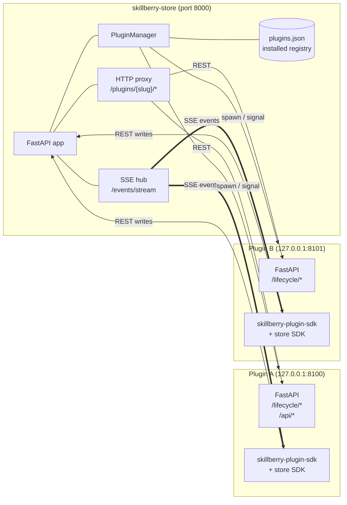
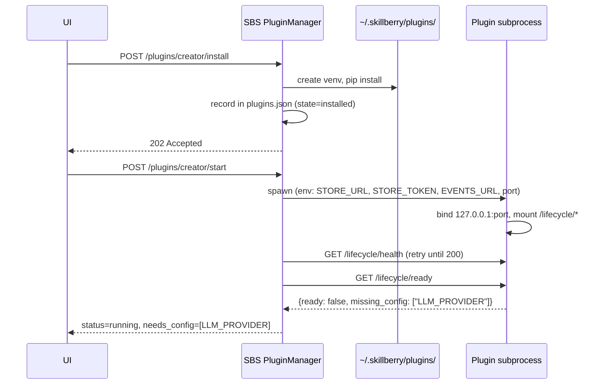
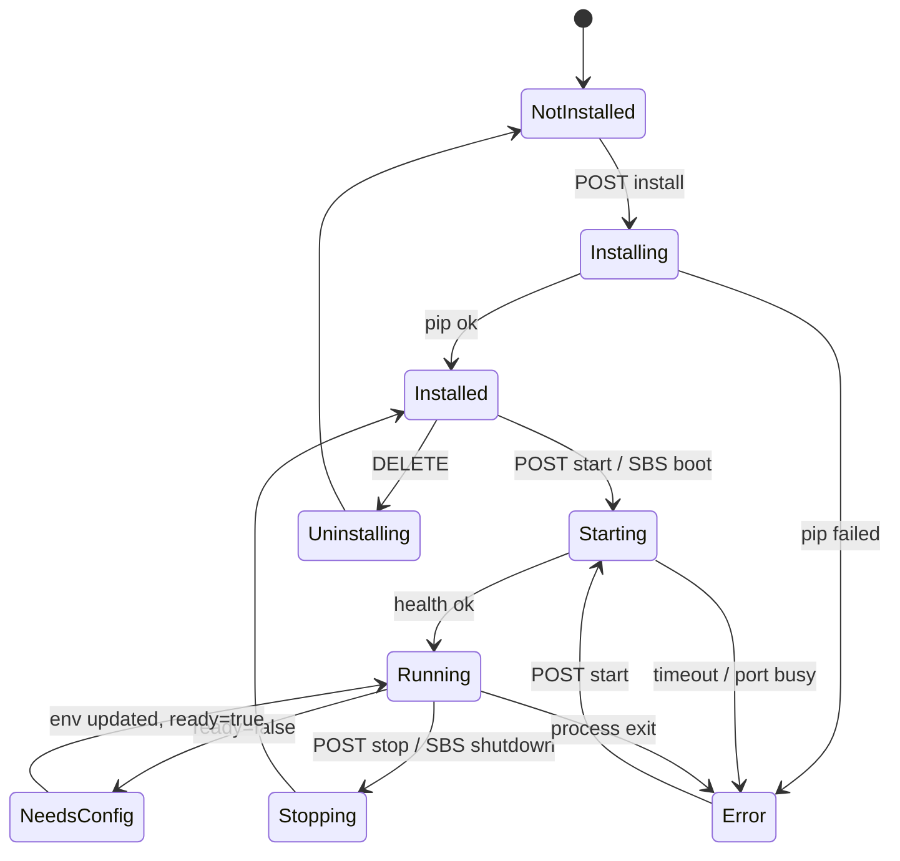
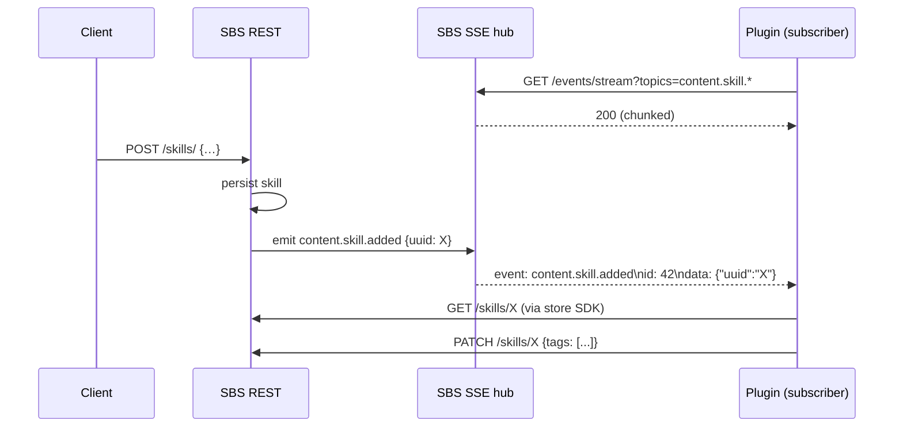
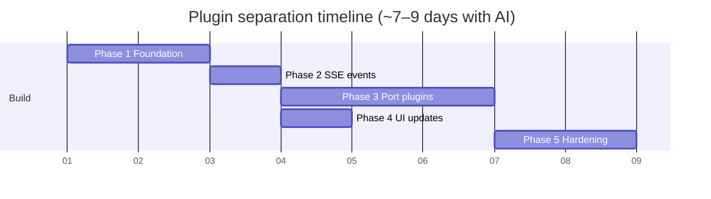

# Plugin Separation Design Plan

Architecture analysis and phased implementation plan for moving plugins to `skillberry-store-plugins` as independent, out-of-process Python packages communicating with skillberry-store (SBS) over the existing HTTP SDK, with **SSE** as the event channel.

This document supersedes the MQTT-based draft. Rationale for SSE over MQTT: see [plugin-architecture-process-vs-thread.md](plugin-architecture-process-vs-thread.md).

---

## Contents

1. [Current State Digest](#1-current-state-digest)
2. [Issues & Observations (validated)](#2-issues--observations-validated)
3. [Key Design Decisions](#3-key-design-decisions)
4. [Target Architecture](#4-target-architecture)
5. [Plugin Lifecycle Protocol](#5-plugin-lifecycle-protocol)
6. [Event Channel — SSE](#6-event-channel--sse)
7. [SDK Surface](#7-sdk-surface)
8. [Backward Compatibility & Migration](#8-backward-compatibility--migration)
9. [Phased Implementation Plan](#9-phased-implementation-plan)
10. [Testing Strategy](#10-testing-strategy)
11. [Risks & Mitigations](#11-risks--mitigations)

---

## 1 · Current State Digest

- **13 plugins** under [plugins/](../plugins/), each a Python package with its own `pyproject.toml`, `src/` layout, and (usually) `tests/`. `dedupe` keeps tests under `src/skillberry_plugin_dedupe/tests/`; the rest use a top-level `tests/`.
- **Discovery**: at startup, [loader.py:37-102](../src/skillberry_store/plugins/loader.py#L37-L102) calls `importlib.metadata.entry_points()` over the `skillberry_store.plugins` group. Each plugin's `pyproject.toml` declares an entry point pointing at a class inheriting [PluginBase](../src/skillberry_store/plugins/base.py).
- **In-process API**: plugins receive a [StoreAPI](../src/skillberry_store/plugins/store_api.py) instance via `set_store_api(...)` ([base.py:141-153](../src/skillberry_store/plugins/base.py#L141-L153)) and call `self.store.*` directly — including raw handler access for file/object I/O.
- **In-process events**: [events.py:14,112-142](../src/skillberry_store/plugins/events.py#L14-L142) maintains a module-global handler registry; `emit_content_*` schedules `asyncio.create_task(...)` on the store loop. The kagenti-approver plugin reaches into the private `_event_handlers` global directly.
- **HTTP mount**: plugin routers are mounted onto the SBS FastAPI app at `/plugins/{slug}/…` ([loader.py:147](../src/skillberry_store/plugins/loader.py#L147)). The docstring at [base.py:74](../src/skillberry_store/plugins/base.py#L74) incorrectly says `/api/plugins/...`; the real prefix is `/plugins/...`.
- **Plugin selection is build-time**: three plugins (`dedupe`, `kagenti-approver`, `simulate`) are pinned under `[project.dependencies]` in [pyproject.toml:141-143](../pyproject.toml#L141-L143). The other 10 live under `[project.optional-dependencies]` extras including `plugins-all`.
- **Plugin disable state**: [PluginConfigStore](../src/skillberry_store/plugins/config.py) persists a `disabled` set to `~/.skillberry/plugins.json` (opt-out model). Path overridable via `SKILLBERRY_PLUGIN_CONFIG`.
- **REST SDK**: [client/python/skillberry_store_sdk/](../client/python/skillberry_store_sdk/) is OpenAPI-generated, pure HTTP, used by external consumers but **not** by in-process plugins today.
- **Streaming already used**: `sse-starlette` is a direct dep (pyproject.toml:103); `EventSourceResponse` is in production in [vmcp_server.py:52,60](../src/skillberry_store/modules/vmcp_server.py#L52-L60). `httpx-sse>=0.4.0` is also a dep (pyproject.toml:40). No WebSockets, no MQTT.
- **UI**: [PluginsPage.tsx](../src/skillberry_store/ui/src/pages/PluginsPage.tsx), [PluginCard.tsx](../src/skillberry_store/ui/src/components/PluginCard.tsx), [api.ts](../src/skillberry_store/ui/src/services/api.ts), and a [Plugin TS type at index.ts:177](../src/skillberry_store/ui/src/types/index.ts#L177).

---

## 2 · Issues & Observations (validated)

### Critical

- **Tight coupling via `PluginBase` import.** All 13 plugin.py files do `from skillberry_store.plugins.base import PluginBase, PluginMetadata, PluginType`. This breaks the moment plugins live outside SBS's venv. PluginBase exposes `set_store_api`, `store` property, `get_router`, `get_ui_config`, `get_cli_commands`, `metadata`, `is_enabled`, `get_status_message`. **There are no lifecycle hooks** (`on_load`/`start`/`stop`) — those need to be added in the new SDK.
- **`StoreAPI` is in-process and grants raw handler access.** [store_api.py](../src/skillberry_store/plugins/store_api.py) hands plugins service singletons and `handler.write_dict(...)` / `read_file(...)` paths. None of this works cross-process; plugins must move to the HTTP SDK.
- **Event system is in-process and reaches private internals.** `kagenti-approver` mutates `skillberry_store.plugins.events._event_handlers` directly. The new SDK must be the only sanctioned channel.

### Important

- **Entry-point discovery requires same-venv install.** Has to be replaced by a `PluginManager` that creates a per-plugin venv, pip-installs the plugin, records it, and launches it as a subprocess.
- **Router mounting at `/plugins/{slug}/…` must remain stable.** UI calls these URLs directly via [api.ts](../src/skillberry_store/ui/src/services/api.ts); the proxy must preserve the URL contract exactly.
- **`plugins.json` semantics must flip** from opt-out (`disabled` set) to opt-in (`installed` map). Migration must be non-destructive — see §8.
- **Three plugins are hard dependencies.** [pyproject.toml:141-143](../pyproject.toml#L141-L143) lists `dedupe`, `kagenti-approver`, `simulate` under `[project.dependencies]`. These have to come out of core deps before the move.

### Considerations

- **`kagenti-approver` is the only event-only plugin** (no `get_router`/`get_ui_config`/`get_cli_commands`). The lifecycle protocol must accept `has_api: false` plugins as valid.
- **`simulate` Docker check is not at-load** — [plugin.py:46-57](../plugins/skillberry-plugin-simulate/src/skillberry_plugin_simulate/plugin.py#L46-L57) calls `docker.from_env().ping()` from `is_enabled()` / `get_status_message()`. Out-of-process, this maps cleanly to `/lifecycle/ready` returning `missing_config: ["docker socket"]`.
- **Port allocation** — currently no plugin opens a port; post-separation each one needs a free local port.
- **Plugin → SBS authentication** — today's in-process model is implicitly trusted. Cross-process needs a token (see §3).

### Already good

- **Per-plugin package structure** is mostly uniform — straightforward `git filter-repo` move.
- **OpenAPI SDK is already generated** and HTTP-only; ready to be reused.
- **`sse-starlette` and `httpx-sse` are already deps** — SSE event channel adds zero new infrastructure.
- **UI declarative `get_ui_config()`** schema transfers as-is to `/lifecycle/info`.

---

## 3 · Key Design Decisions

| Question | Decision | Rationale |
|---|---|---|
| Deployment unit | Subprocess per plugin, managed by SBS | Independent deps, crash isolation, container-ready with same contract |
| Shared lifecycle code | New **`skillberry-plugin-sdk`** package (lifecycle + events helpers) | Stable, versioned contract with no `skillberry_store` import |
| Store access | Existing `skillberry-store-sdk` (HTTP REST) | Already generated; clean boundary |
| Event channel | **SSE** stream from SBS, served by the same FastAPI app | Zero new infra (`sse-starlette`/`httpx-sse` already deps); same auth as REST; reconnect with `Last-Event-ID` |
| Plugin REST proxy | SBS reverse-proxies `/plugins/{slug}/{path}` → `http://127.0.0.1:{port}/{path}` via `httpx.AsyncClient` | Preserves existing URL contract for the UI; no protocol change for callers |
| Plugin catalog | `index.yaml` in `skillberry-store-plugins` repo, fetched by URL | No registry service; PR-able catalog |
| Install mechanism | `pip install` into per-plugin venv under `~/.skillberry/plugins/{slug}/` | Standard tooling; reversible; no Docker needed for dev |
| Persistence | Extend `~/.skillberry/plugins.json` with `installed` map (slug → {path, port, env_overrides, state}); keep `disabled` set during migration | Backward-compatible migration (see §8) |
| Network exposure | Plugin uvicorn binds **127.0.0.1 only**; external access only via SBS proxy | Defense in depth — plugins are not separately authenticated to the world |
| Plugin → SBS auth | Per-plugin random token passed via env (`SKILLBERRY_STORE_TOKEN`), validated by SBS middleware | Plugins are no longer in-process-trusted |
| Required config declaration | Plugin `manifest.yaml` declares `required_env`; SBS validates and surfaces gaps in UI | Declarative; no custom protocol |

---

## 4 · Target Architecture

### Component view



### Repository layout

```
skillberry-store-plugins/
├── index.yaml                       ← catalog of all plugins
├── skillberry-plugin-sdk/           ← new shared package
│   ├── pyproject.toml
│   └── src/skillberry_plugin_sdk/
│       ├── lifecycle.py             ← PluginLifecycleBase
│       ├── manifest.py              ← PluginManifest model
│       ├── events.py                ← SSE subscriber (httpx-sse)
│       ├── runner.py                ← __main__ launcher (uvicorn)
│       └── testing.py               ← pytest fixtures
├── skillberry-plugin-creator/
│   ├── manifest.yaml                ← name, version, required_env, port_hint
│   ├── pyproject.toml
│   ├── src/.../plugin.py            ← extends PluginLifecycleBase
│   └── tests/
└── …                                ← all other plugins
```

---

## 5 · Plugin Lifecycle Protocol

Each plugin process exposes the following HTTP endpoints (provided by `skillberry-plugin-sdk`):

| Endpoint | Method | Description |
|---|---|---|
| `/lifecycle/health` | GET | `{"status":"ok"}` — used by SBS health probe |
| `/lifecycle/info` | GET | Plugin manifest: name, version, plugin_type, required_env, ui_config, sdk_version, has_api |
| `/lifecycle/ready` | GET | `{"ready":bool,"missing_config":[…]}` |
| `/lifecycle/shutdown` | POST | Graceful shutdown; SBS sends before SIGTERM |

### Manifest (`manifest.yaml`)

```yaml
name: "Snippet Creator"
slug: creator
version: "0.1.0"
description: "Create code snippets using an LLM"
plugin_type: creator
author: "IBM"
homepage: "https://..."
sdk_version: "^0.1"
has_api: true
required_env:
  - name: LLM_PROVIDER
    description: "LLM provider, e.g. openai.async"
    required: true
  - name: LLM_MODEL
    description: "Model name"
    required: false
    default: "gpt-4"
port_hint: 8100
```

### Install / start sequence



### Plugin state machine



---

## 6 · Event Channel — SSE

### Why SSE, not MQTT

`sse-starlette` and `httpx-sse` are already dependencies. The store's FastAPI app already serves SSE for VMCP. Adding an embedded MQTT broker (Mosquitto sidecar or `amqtt` in-process) is gratuitous infrastructure that buys nothing for the event volume plugins actually produce. SSE collapses commands and events onto one transport (HTTP) and one auth model (the same per-plugin token).

### Endpoint

```
GET /events/stream?topics=content.skill.*,content.tool.added
Authorization: Bearer <plugin-token>
Accept: text/event-stream
Last-Event-ID: <opaque>           ← optional, for resume
```

Response: a chunked `text/event-stream` with `event: ` and `id: ` fields per SSE spec. Topics use dot-segmented wildcards (`content.*.added` matches all add events; `*` is single-segment, `**` is multi-segment).

### Topic schema

| Topic | Publisher | Payload |
|---|---|---|
| `content.{type}.added` | SBS | `{"uuid":"…","type":"skill"}` |
| `content.{type}.updated` | SBS | `{"uuid":"…","type":"skill"}` |
| `content.{type}.deleted` | SBS | `{"uuid":"…","type":"skill"}` |
| `plugin.{slug}.log` *(optional, phase 5)* | Plugin → SBS | Log line for UI streaming |

### Delivery semantics

- **At-least-once with replay window.** SBS maintains a small ring buffer (last N=1000 events) keyed by monotonically increasing event id. On reconnect with `Last-Event-ID`, replay everything newer.
- **Per-plugin queue depth limit.** A slow consumer is dropped at queue depth 5000; SBS logs a warning and forces it to reconnect (will replay from `Last-Event-ID`).
- **No durability across SBS restart.** Events are in-memory only — matches today's `asyncio.create_task` semantics. Plugins must tolerate missed events on SBS restart (kagenti-approver already tolerates this).

### Event flow



---

## 7 · SDK Surface

Two SDKs are involved. **Neither breaks existing external consumers.**

### A. `skillberry-store-sdk` (existing, additive change)

The OpenAPI-generated REST client already exists at [client/python/skillberry_store_sdk/](../client/python/skillberry_store_sdk/). It will gain a hand-written companion module `events.py` (not generated, since SSE isn't in the OpenAPI spec) that exposes:

```python
class EventsClient:
    def __init__(self, base_url: str, token: str): ...
    async def subscribe(
        self,
        topics: list[str],
        handler: Callable[[Event], Awaitable[None]],
        *,
        last_event_id: str | None = None,
    ) -> None:
        """Long-running; auto-reconnects with exponential backoff."""
```

This module is additive — the generated `ApiClient` surface and class names stay byte-identical. Existing SDK users see no diff.

### B. `skillberry-plugin-sdk` (new)

Thin, ~few-hundred-line package that plugins depend on. Exposes:

```python
from skillberry_plugin_sdk import PluginLifecycleBase, on_event, run

class CreatorPlugin(PluginLifecycleBase):
    manifest_path = "manifest.yaml"

    async def on_start(self) -> None:
        self.store = await self.connect_store()       # returns ApiClient
        self.events = self.connect_events()           # returns EventsClient

    @on_event("content.skill.added")
    async def handle_new_skill(self, event):
        skill = await self.store.skills.get(event.uuid)
        ...

    def get_router(self) -> APIRouter | None:
        return router        # optional REST surface

if __name__ == "__main__":
    run(CreatorPlugin)       # bootstraps uvicorn, mounts /lifecycle/*
```

`run()` reads `SKILLBERRY_STORE_URL`, `SKILLBERRY_STORE_TOKEN`, `SKILLBERRY_EVENTS_URL`, `SKILLBERRY_PLUGIN_PORT` from the env, binds to 127.0.0.1, mounts `/lifecycle/*` automatically, and starts uvicorn.

The SDK ships pytest fixtures (`sbs_fixture`, `plugin_fixture`) that spawn a real SBS and a plugin subprocess for integration tests in each plugin repo.

### Versioning

The plugin manifest declares `sdk_version: "^0.1"`. SBS checks compatibility against its bundled SDK version on install and refuses incompatible plugins. SDK follows semver; breaking changes bump major.

---

## 8 · Backward Compatibility & Migration

The migration is staged so SBS keeps working with **both** in-process plugins (today's model) and out-of-process plugins (new model) until every plugin has been ported. This avoids an atomic-cutover failure mode.

### REST API stability

- `/plugins/`, `/plugins/{slug}`, and `/plugins/{slug}/{any}` routes keep their existing shape. New endpoints (`POST /plugins/{slug}/install`, etc.) are additive — no breaking change to current UI/API consumers.
- The OpenAPI SDK regenerates with the new endpoints added; classes for existing endpoints are byte-identical. No required upgrade for downstream consumers.

### `plugins.json` migration

The config store auto-migrates on first load:

```json
// Old (current)
{"disabled": ["plugin-foo"]}

// After first start of new SBS — disabled is preserved
{
  "version": 2,
  "disabled": ["plugin-foo"],
  "installed": {
    "skillberry-plugin-dedupe": {"path": "<built-in>", "port": null, "state": "in_process", "env": {}},
    ...
  }
}
```

In-repo plugins discovered via entry-points are auto-recorded as `state: in_process` so they continue working. As each plugin is ported to the new model, its record flips to `state: installed` with a real `path` and `port`. No user action required.

### `PluginBase` shim

`PluginBase` is kept as a deprecated shim for one release cycle. It emits `DeprecationWarning` on import and continues to work in-process for any plugin not yet ported. The shim is deleted in the release after all 13 plugins are ported.

### URL contract

`/plugins/{slug}/…` continues to work whether the plugin is in-process (mounted router) or out-of-process (HTTP proxy). UI and external API consumers see no difference.

---

## 9 · Phased Implementation Plan

Total estimate with AI assistance: **~7–9 working days**, vs ~10–15 in the original plan. The compression comes from (a) no broker process to operate, package, or test, (b) parallelizing plugin ports in Phase 3, and (c) collapsing the original Phase 0/1 into one phase since SDK and manager are co-designed.

### Phase 1 — Foundation: SDK + PluginManager (2 days)

Backward-compatible additions only. SBS continues to load entry-point plugins exactly as today.

1. Create `skillberry-store-plugins` repo (or sibling branch) with the §4 layout.
2. Build `skillberry-plugin-sdk`:
   - `PluginLifecycleBase` mounting `/lifecycle/*`.
   - `PluginManifest` Pydantic model + `manifest.yaml` parser.
   - `EventsClient` SSE subscriber (uses already-present `httpx-sse`).
   - `run()` uvicorn launcher.
   - `testing` module: `sbs_fixture`, `plugin_fixture`.
3. Add the SSE `events.py` companion module to `skillberry-store-sdk` and update its release build.
4. Add `PluginManager` in [src/skillberry_store/plugins/manager.py](../src/skillberry_store/plugins/manager.py): registry CRUD, venv install/remove, subprocess start/stop, health probe.
5. Add the new API endpoints (additive):
   - `GET /plugins/available/` (catalog)
   - `POST /plugins/{slug}/install`, `DELETE /plugins/{slug}`
   - `POST /plugins/{slug}/start`, `POST /plugins/{slug}/stop`
   - `GET /plugins/{slug}/status`
6. Add the proxy route: `app.add_route("/plugins/{slug}/{path:path}", proxy_handler)`. Falls back to today's mounted router if the plugin is `state: in_process`.
7. Auto-migrate `plugins.json` to v2 on first load.
8. Unit tests for manager, SDK lifecycle, manifest parsing, registry migration.

### Phase 2 — SSE events in SBS (1 day)

1. Add `GET /events/stream` SSE endpoint with topic filter, ring buffer, `Last-Event-ID` replay.
2. Refactor [events.py](../src/skillberry_store/plugins/events.py) `emit_content_*` helpers to **also** publish to the SSE hub, in addition to the in-process callback registry. Keep the in-process path live during migration.
3. Wire per-plugin auth tokens — SBS issues one on install, validates on every plugin request and on SSE connect.
4. Port `kagenti-approver` as the first end-to-end SSE consumer (it's event-only — simplest case).

### Phase 3 — Move plugins to new repo & port (3 days)

Ports can run in parallel; each plugin is independent. With AI assistance, ~3–5 plugin ports per day is realistic.

1. `git filter-repo` each plugin dir into `skillberry-store-plugins/`.
2. Per plugin:
   - Drop `from skillberry_store.plugins.base import …`; subclass `PluginLifecycleBase`.
   - Replace `self.store.*` with `skillberry_store_sdk.ApiClient` calls.
   - Replace event registration with `@on_event(...)` decorators.
   - Add `__main__.py` calling `run(PluginClass)`.
   - Add `manifest.yaml`.
   - Move tests; add an integration test using `sbs_fixture` + `plugin_fixture`.
3. Remove the three plugins from `[project.dependencies]` in the SBS `pyproject.toml`; remove all plugin extras.
4. After all 13 plugins are ported and passing: mark `PluginBase`, `StoreAPI`, in-process `events.py` handlers, `loader.py` as deprecated. Do **not** delete in this phase — that's Phase 5.

### Phase 4 — UI updates (1 day)

1. [PluginsPage.tsx](../src/skillberry_store/ui/src/pages/PluginsPage.tsx): split into *Available* and *Installed* sections; install/uninstall/start/stop actions; surface `missing_config`.
2. [PluginCard.tsx](../src/skillberry_store/ui/src/components/PluginCard.tsx): add `install_state` prop (`available | installing | installed | running | needs_config | error`).
3. [api.ts](../src/skillberry_store/ui/src/services/api.ts): add `pluginsApi.listAvailable / install / uninstall / start / stop / getStatus`.
4. Extend the [Plugin TS type](../src/skillberry_store/ui/src/types/index.ts#L177) with `install_state`, `missing_config`, `port`.
5. Update component tests; add a Playwright e2e for the install→start→invoke flow.

### Phase 5 — Hardening, cleanup, docs (1–2 days)

1. Delete `PluginBase`, `StoreAPI`, in-process event registry, `loader.py`, plugin `config.py` opt-out branch.
2. CI: in `skillberry-store-plugins`, every plugin's tests run with a real SBS subprocess via `sbs_fixture`.
3. Add a CI lint that fails any plugin missing `manifest.yaml` or with an incompatible `sdk_version`.
4. Update the [Dockerfile](../Dockerfile) — no Mosquitto, no broker. Optionally bundle a default set of plugins in a layered image.
5. Author guide for new plugins; update [plugins-installation.md](plugins-installation.md).
6. End-to-end resilience tests: kill a plugin process, verify SBS marks it `error` and the proxy returns 503; restart and verify replay.

### Phase ordering



---

## 10 · Testing Strategy

| Level | Location | Coverage |
|---|---|---|
| Unit — SBS PluginManager | `src/skillberry_store/tests/plugins/` | Registry CRUD, catalog fetch (mocked HTTP), venv create (tmp dir), subprocess start/stop (mock `asyncio.subprocess`), proxy routing, SSE hub publish/replay, ring buffer, token validation |
| Unit — `skillberry-plugin-sdk` | `skillberry-plugin-sdk/tests/` | `PluginLifecycleBase` routes, manifest parsing, EventsClient reconnect/replay (mock SSE server) |
| Unit — each plugin | `skillberry-store-plugins/{plugin}/tests/` | Business logic; mock store SDK; mock `@on_event` dispatch |
| Integration — per plugin | `skillberry-store-plugins/{plugin}/tests/` | `sbs_fixture` + `plugin_fixture`; install→start→invoke→event roundtrip |
| Integration — SBS e2e | `src/skillberry_store/tests/e2e/` | Full install/start/stop/uninstall flow, missing-config surfacing, restart persistence, SSE replay after disconnect, slow-consumer eviction |
| UI — component | `src/skillberry_store/ui/src/` | `PluginCard` state transitions; `PluginsPage` list/install flows (mocked API) |
| UI — Playwright | `src/skillberry_store/ui/e2e/` | Install→configure→invoke against running SBS |

---

## 11 · Risks & Mitigations

| Risk | Severity | Mitigation |
|---|---|---|
| Breaking in-process plugin tests mid-migration | Medium | `PluginBase` kept as deprecated shim through Phase 4; ported plugins drop it; full deletion only after all green in Phase 5 |
| SSE connection drop loses events | Low | Ring buffer + `Last-Event-ID` replay; plugins reconnect with exponential backoff; documented "events are not durable across SBS restart" — matches today's semantics |
| Slow plugin chokes the SSE hub | Low | Per-plugin queue depth cap (5000); SBS evicts and lets plugin reconnect-with-replay |
| Plugin port conflicts on shared dev hosts | Medium | PluginManager allocates from a configurable range (default 8100–8200) using `socket.bind(0)` test before commit; record port in `plugins.json` |
| Plugin process leaks (crashed parent) | Medium | Plugins write a PID file on start; SBS reaps orphans at next start; on Linux, set `prctl(PR_SET_PDEATHSIG, SIGTERM)` so child dies with parent |
| Plugin runs untrusted code with SBS token | High | Plugins are first-party; nonetheless: token scoped to plugin's own UUID namespace where feasible; plugin uvicorn binds 127.0.0.1 only; document install-time review expectations |
| `pip install` slow / network-dependent | Low | Install is async with 202+poll status; UI shows progress; SBS caches wheels under `~/.skillberry/wheels/` |
| `simulate` needs Docker at runtime | Medium | Plugin reports via `/lifecycle/ready` → `missing_config: ["docker socket"]`; UI surfaces — no regression from today |
| `kagenti-approver` has no REST API | Low | Manifest declares `has_api: false`; SBS proxy returns 404 for `/plugins/kagenti-approver/*` and the UI hides API rows |
| `plugins.json` migration fails on an old install | Medium | Migration writes `.bak` next to the file; failure logs the bak path and continues with empty registry (old `disabled` set still respected via the v1 shim) |
| Git history loss when moving plugins | Low | Use `git filter-repo --path plugins/<slug>/` to preserve full history per plugin |
| Circular dep (plugin needs SDK needs SBS running) | Low | SDK is pure HTTP — no runtime SBS dependency at install; only needs SBS reachable at *start* time |
